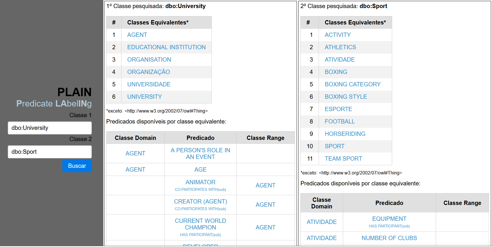

# PLAIN - Predicate Labeling

Módulo de Consulta a Catálogos de Vocabulários Controlados:

Aplicação WEB que permite a realização de uma série de consultas ao SPARQL Endpoint do Linked Open Vocabularies - LOV.

Módulo para Extração de Relações:

Script em Python que realiza a leitura de um arquivo com um conjunto de sentenças.

#Recomendações:

Utilizar o PHP 7.3 ou superior, disponível no site:
https://www.php.net/downloads.php

Para o módulo de extração de relações:

Utilizar o Anaconda Navigator 1.9.12 , disponível no site: https://www.anaconda.com/products/individual

Instalar o OpenNRE, disponível no repositório:
https://github.com/thunlp/OpenNRE

#Trabalho publicado:

SILVEIRA, R. N. da; CAVALCANTI, M. C. Método para rotular ligações semânticas na web de dados. In: SBBD2020-FullPapers(). [s.n.], 2020. Disponível em: <https://sbbd.org.br/2020/wp-content/uploads/sites/13/2020/09/Rotular-ligacoes-ST3.pdf>.